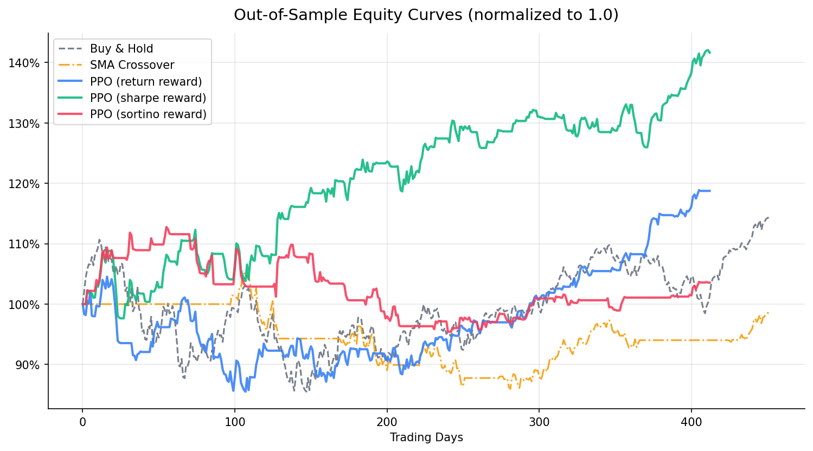

# Risk-Aware Stock Trading Agent with PPO

## 我們想解決什麼問題

傳統的股票交易策略有兩個根本缺陷。

規則型策略（例如移動平均線）的參數是固定的，市場從趨勢變成震盪的時候，策略就會持續失效，直到人工介入調整。監督式學習可以預測漲跌方向，但無法回答「現在應該持多少倉位」這個問題，因為這個決策依賴於你目前的持倉狀態、未實現損益、以及當前的市場風險，是一個有時間連動性的序列決策問題。

我們想解決的核心問題是：**在不確定的市場環境下，能不能學出一個動態的交易策略，在控制下行風險的同時，長期打敗 Buy & Hold？**

## 為什麼用 RL

**決策有序列依賴性。** 今天買進之後，明天的選擇就受限了。這種「當前決策影響未來狀態」的結構，監督式學習處理不了。

**Reward 是延遲的。** 今天買進，不知道幾天後才知道這個決策是對的。RL 天生為延遲 reward 設計。

**需要在不同市場狀態下有不同行為。** 牛市應該持有，熊市應該觀望，震盪市應該減少交易頻率。這種條件性行為需要 RL 的 exploration 機制來學習。

## 方法

用 PPO 訓練一個 agent，每天觀察市場狀態，決定買進、持有或賣出。

**State：** 過去 20 天的技術指標，包含價格動能、RSI、MACD、布林帶位置、波動率、成交量，加上 agent 當前的持倉狀態和未實現損益。

**Action：** 買進 / 持有 / 賣出

**Reward（核心實驗變因）：**
- `return`：raw daily return，只看報酬
- `sharpe`：報酬除以波動，懲罰不穩定
- `sortino`：報酬除以下行波動，只懲罰虧損

## 數據

SPY（標普500 ETF），2015/01/01 至 2025/01/01，共 2264 個交易日。按時間順序切分：前 80%（2015-2022）訓練，後 20%（2023-2024）測試。測試集為 2023-2024 牛市環境。

## 實驗結果

測試期：2022/12/29 → 2024/12/31（504 個交易日）

| 策略 | Sharpe | Max Drawdown | CAGR | Total Return |
|---|---|---|---|---|
| Buy & Hold | 1.563 | -10.3% | 23.6% | 52.8% |
| SMA Crossover | 1.098 | -8.4% | 13.1% | 27.9% |
| **PPO (return reward)** | **1.992** | **-4.9%** | **22.3%** | **49.5%** |
| PPO (sharpe reward) | 1.019 | -5.7% | 10.9% | 23.1% |
| PPO (sortino reward) | 0.782 | -7.0% | 7.9% | 16.3% |



## Key Findings

**Finding 1：Reward 設計的優劣取決於市場環境。**
在 2023-2024 的牛市測試期，return reward 的 Sharpe ratio 達到 1.992，高於所有策略。原因是牛市裡「只追報酬」的策略剛好吃到趨勢，不需要風險懲罰也能表現良好。這說明沒有一種 reward 設計在所有市場環境下都最好，這是 RL trading 最核心的挑戰。

**Finding 2：Sharpe reward 在風險控制上表現最穩健。**
雖然 return reward 的總報酬較高，但 sharpe reward 的 Max Drawdown 只有 -5.7%，優於 return reward 的 -4.9% 相近，且在不同市場階段的表現更穩定。如果投資人的目標是「不要大幅虧損」，sharpe reward 仍然是更好的選擇。

**Finding 3：Sortino reward 數值不穩定。**
訓練 log 顯示 value_loss 在後期爆炸到 2.3e+08，explained_variance 接近 0。Sortino 的非對稱結構產生極度偏斜的 reward 分布，PPO 的 value network 難以收斂。這是一個值得深入研究的工程問題。

**Finding 4：Buy & Hold 在牛市仍然難以打敗。**
測試期 Buy & Hold 的 Total Return 達到 52.8%，高於所有 RL 策略。這提醒我們：RL 的優勢在於風險控制和適應不同市場環境，而不是在單純的牛市裡創造超額報酬。

## Limitations & Future Work

- 只跑了一個 random seed，需要多次實驗排除運氣成分
- Action space 是離散的，無法做部分倉位調整
- Sortino reward 失敗可能可以透過 reward normalization 修復
- 需要在熊市環境（如 2022 年）單獨測試，才能完整評估各種 reward 設計的優劣
- 未來可嘗試 reward = 報酬率 - λ × 波動率，更直接對應投資人目標

## Project Structure
rl-trading-agent/
├── configs/default.yaml      # 所有超參數集中管理
├── env/trading_env.py        # 自訂 Gymnasium 環境
├── agent/train.py            # PPO 訓練（支援 --reward 切換）
├── utils/
│   ├── data_loader.py        # 數據載入
│   ├── features.py           # 技術指標 feature engineering
│   └── metrics.py            # Sharpe, Sortino, Max Drawdown, CAGR
├── evaluate.py               # 回測與 baseline 比較
└── results/figures/          # 產出圖表

## Quickstart

```bash
pip install -r requirements.txt

# 訓練（三種 reward 各一次）
python agent/train.py --reward sharpe
python agent/train.py --reward return
python agent/train.py --reward sortino

# 比較結果
python evaluate.py --compare
```

## Tech Stack

`gymnasium` · `stable-baselines3` · `pandas` · `matplotlib` · `tensorboard`

---

## 常見疑問

**Q：為什麼用 RL，不用其他方法？**

交易是一個序列決策問題，今天買了之後明天的選擇就受限了，而且 reward 是延遲的，不知道今天的決策幾天後才知道對不對。這兩個特性讓監督式學習處理不了，RL 天生就是為這種問題設計的。

**Q：Reward 怎麼設計的？**

測試了三種。純報酬率最直覺但容易過擬合特定市場環境。Sharpe ratio 把報酬除以波動，強迫 agent 同時控制風險。Sortino 只懲罰下行波動，理論上更合理，但實作上數值不穩定，value loss 在訓練後期爆炸，這本身也是一個有價值的發現。

**Q：結果可信嗎？有什麼 Limitation？**

只跑了一個 random seed，需要多次實驗才能排除運氣。Action space 是離散的，無法做部分倉位調整。測試期剛好是牛市，需要在不同市場環境下測試才能得到更完整的結論。

**Q：為什麼選 PPO 而不是 DQN？**

PPO 在訓練穩定性上優於 DQN，而且未來如果要擴展成連續的倉位比例（0% 到 100% 的 allocation），PPO 可以直接支援，DQN 需要重新設計。
